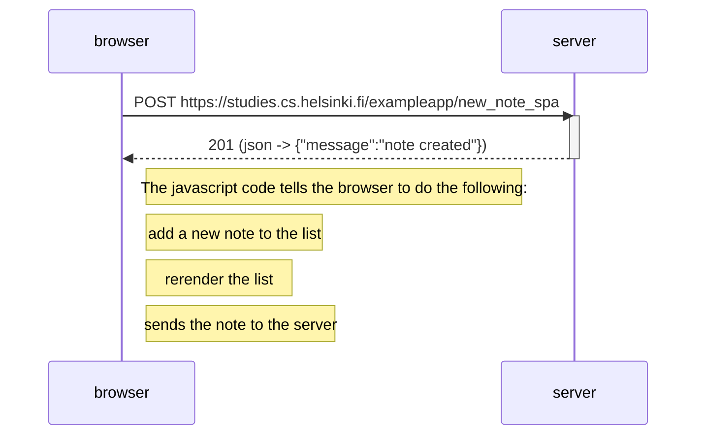

```mermaid
sequenceDiagram
    participant browser
    participant server

    browser->>server: POST https://studies.cs.helsinki.fi/exampleapp/new_note_spa
    activate server
    server-->>browser: 201 (json -> {"message":"note created"})
    deactivate server

    Note right of browser: The javascript code tells the browser to do the following:
    Note right of browser: add a new note to the list
    Note right of browser: rerender the list
    Note right of browser: sends the note to the server
```